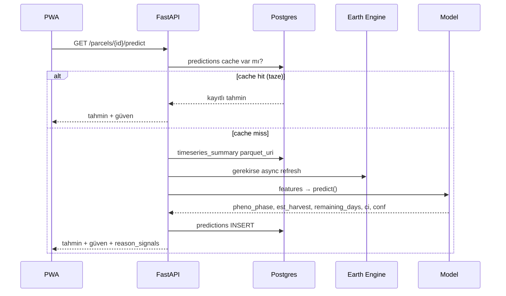

# 04 — Teknik Mimari (Akademik MVP ve Ticari Ölçek)

> **Amaç:** Sistem mimarisini iki olgunluk seviyesinde tanımlamak; akademik prototipte hızı, ticari ölçekte sürdürülebilirliği ve bağımsızlığı sağlamak.
> **Kapsam:** Akademik MVP mimarisi, ticari ölçek mimarisi, GEE bağımlılığı ve yerel pipeline alternatifi (rasterio + xarray + dask + STAC + COG), API uçları (V1/V2), veri tabanı şeması, güven skoru hesabı, açıklanabilirlik akışı, dağıtım, güvenlik, gözlemlenebilirlik.
> **Son güncelleme:** 2026-05-10

---

## 1. İki seviyeli mimari özeti

```
┌─────────────────────────────────────────────────────────────────────────┐
│                  AKADEMİK MVP MİMARİSİ (Faz 1–3)                         │
│                                                                         │
│   GEE  →  Notebook ETL  →  Parquet/PostGIS  →  Streamlit  →  PWA        │
│   (server-side)        (lokal/Supabase)  (V1 demo)   (V2 ürün)          │
│                                                                         │
│   En basit çalışan pipeline. Ödün: vendor lock-in (Google).             │
└─────────────────────────────────────────────────────────────────────────┘

┌─────────────────────────────────────────────────────────────────────────┐
│                  TİCARİ ÖLÇEK MİMARİSİ (Faz 4–5+)                         │
│                                                                         │
│  STAC katalog  →  rasterio + xarray + dask  →  PostGIS + Object store   │
│  (open + ticari)  (yerel/cluster)              (kendi altyapı)          │
│                          ↓                                              │
│              FastAPI + Worker Queue (Celery/RQ)                         │
│                          ↓                                              │
│              PWA + React Native + Webhook + API müşterileri             │
│                                                                         │
│   Ölçek + bağımsızlık + KVKK kontrolü. Maliyet artar.                   │
└─────────────────────────────────────────────────────────────────────────┘
```

İki mimari **aynı veri modelini ve API sözleşmesini** paylaşır; geçiş mümkün olduğunca kademeli yapılır (`ADR-008`).

---

## 2. Akademik MVP mimarisi (en basit çalışan pipeline)

### 2.1. Üst görünüm

```
┌──────────────────────────────────────────────────────────────────────────────┐
│                              KULLANICI KATMANI                                │
│                                                                              │
│   Streamlit (Faz 2)                     PWA — React+Vite (Faz 3)             │
│   - tek harita + parsel + grafik        - harita + auth + API çağrıları       │
│   - "ekran kaydı yedeği"                - mobil uyumlu, offline cache         │
└──────────────────────────────────┬───────────────────────────────────────────┘
                                   │ HTTPS / JSON / JWT (Faz 3+)
┌──────────────────────────────────▼───────────────────────────────────────────┐
│                              UYGULAMA KATMANI                                 │
│                                                                              │
│   FastAPI (Python 3.11)                                                      │
│   /auth /parcels /timeseries /predict /labels /jobs                          │
│   Pydantic v2 + SQLAlchemy 2.0 + Uvicorn                                     │
└────────┬────────────────────────────────────────────┬────────────────────────┘
         │                                            │
┌────────▼────────────────┐                ┌──────────▼──────────────────────┐
│   VERİ KATMANI          │                │   HESAPLAMA KATMANI              │
│   PostgreSQL+PostGIS    │◀──────────────▶│   GEE (akademik)                 │
│   parcels, labels,      │   parcel ids   │   - Sentinel-2/1 collection     │
│   predictions, runs     │   sonuçlar     │   - bulut maskesi               │
│                         │                │   - indeks hesaplama (server)    │
│   Object: Supabase      │                │                                  │
│   Storage (parquet)     │                │   Model: scikit-learn + xgboost  │
└─────────────────────────┘                └──────────────────────────────────┘
```

### 2.2. Akış (sequence)



### 2.3. Veri önbellekleme stratejisi

| Katman | Önbellek | TTL | Amaç |
|---|---|---|---|
| GEE çağrısı | Parquet/parcel_id+season | 24 sa (sezon dışı) / 6 sa (aktif sezon) | GEE kotası ve gecikme |
| Tahmin (predictions) | DB satırı + `predicted_at` | 6 sa | Aynı parsele çoklu istek |
| API yanıtı | HTTP cache (`stale-while-revalidate`) | 5 dk | PWA tarafı |
| Frontend asset | service worker | sürüm kadar | PWA offline |

Önbellek **görünür** olur — UI'da "son güncelleme: 2 sa önce" mesajı.

---

## 3. Ticari ölçek mimarisi (yerel pipeline'a geçiş)

### 3.1. Neden geçiş?

- **Vendor lock-in.** GEE kapanır veya ücretlenirse iş durur.
- **KVKK / veri kontrolü.** Müşteri verisi Google sunucusundan geçmesin.
- **Performans / SLA.** Kotaya bağlı olmayan, ölçeklenebilir hesap.
- **Akademik tekrar üretilebilirlik.** Docker'a sığan, GEE'siz kurulum yayın için tercih edilir.

### 3.2. Yerel pipeline bileşenleri

| Bileşen | Rol | Araçlar |
|---|---|---|
| **STAC katalog** | Açık veri arama (Element84 Earth Search, Microsoft Planetary, Copernicus DataSpace) | `pystac-client` |
| **COG (Cloud-Optimized GeoTIFF)** | HTTP üzerinden parsel-pencere okuma | `rio-tiler`, `rasterio` |
| **rasterio / xarray / dask** | Çok boyutlu raster + paralelleştirme | `xarray`, `dask`, `pyproj` |
| **odc-stac veya stackstac** | STAC sorgusunu xarray'e çevirme | `odc-stac` |
| **Object storage** | Parquet + GeoTIFF cache | S3 / GCS / MinIO |
| **Queue runner** | ETL işlerini async tetikleme | Celery + Redis veya RQ |
| **Compute** | CPU/GPU işleri | Container (Fargate / Cloud Run / k8s) |

### 3.3. Üst görünüm (ticari)

```
┌──────────── İSTEMCİ ────────────┐    ┌──────── KURUMSAL ENTEGRASYON ────────┐
│  PWA  +  React Native  +  API   │    │   Webhook  +  CSV/Parquet ihracat    │
└───────────────┬─────────────────┘    └──────────────┬───────────────────────┘
                │                                     │
                └─────────────┬───────────────────────┘
                              │
                  ┌───────────▼─────────────┐
                  │  FastAPI (gunicorn)     │
                  │  rate-limit / SLA       │
                  └───────────┬─────────────┘
                              │
       ┌──────────────────────┼──────────────────────────┐
       │                      │                          │
┌──────▼──────┐    ┌──────────▼─────────┐    ┌───────────▼───────────┐
│ Postgres    │    │  Worker queue       │    │  Object storage        │
│ (PostGIS,   │    │  (Celery/RQ + Redis)│    │  (S3/GCS/MinIO)        │
│  RLS,       │    └──────────┬──────────┘    └────────────┬───────────┘
│  partition) │               │                            │
└─────────────┘               ▼                            ▼
                  ┌──────────────────────┐   ┌──────────────────────────┐
                  │ Yerel pipeline        │   │ STAC kataloglar           │
                  │ rasterio + xarray     │   │ Element84 / MS Planetary  │
                  │ dask cluster          │◀──│ Copernicus DataSpace      │
                  └──────────┬────────────┘   └──────────────────────────┘
                             │
                             ▼
                  ┌──────────────────────┐
                  │ Model katmanı        │
                  │ rules + RF + XGB     │
                  │ + LSTM/TFT (V4)      │
                  └──────────────────────┘
```

### 3.4. Geçiş planı (kademeli)

| Faz | GEE rolü | Yerel pipeline rolü |
|---|---|---|
| 0–2 | Birincil hesap | Yok |
| 3 | Üretim | Paralel notebook'larda doğrulama |
| 4 | Doğrulama | Üretim için kritik adımlar |
| 5 | Yedek (akademik) | Tam üretim |

Bu aşamalı geçişle: erken hız + ileride bağımsızlık.

---

## 4. Repo / klasör yapısı

```
hasat-zamani/
├── README.md
├── pyproject.toml              # uv veya poetry
├── docker-compose.yml          # postgres + minio + api
├── .github/workflows/
│   ├── ci.yml
│   └── cd.yml
├── backend/
│   ├── app/
│   │   ├── main.py
│   │   ├── routers/  (auth, parcels, timeseries, predict, labels)
│   │   ├── services/  (gee_client, stac_client, phenology, rules, ml_predict)
│   │   ├── models/   (SQLAlchemy)
│   │   ├── schemas/  (Pydantic)
│   │   └── tests/
│   ├── alembic/
│   └── Dockerfile
├── frontend/
│   ├── src/
│   │   ├── pages/  (MapView, ParcelDetail, Settings)
│   │   ├── components/  (MapCanvas, TimeSeriesChart, PredictionCard, ConfidencePill, ReasonPanel)
│   │   ├── api/
│   │   └── pwa/
│   └── Dockerfile
├── notebooks/
│   ├── 01_extract_timeseries.ipynb
│   ├── 02_phenology_rules.ipynb
│   ├── 03_ml_baseline.ipynb
│   ├── 04_xgb_remaining_days.ipynb
│   └── 05_validation.ipynb
├── data/
│   ├── parcels/   (geoparquet)
│   ├── labels/    (csv)
│   └── timeseries/  (parquet)
├── ml/
│   ├── train.py / evaluate.py / features.py
│   └── artifacts/
├── ops/
│   └── scripts/
└── docs/
    ├── ARCHITECTURE.md (bu dosyanın özeti)
    ├── DATA_DICTIONARY.md
    └── api/
```

---

## 5. Veri tabanı şeması (PostGIS)

```sql
CREATE TABLE parcels (
  id BIGSERIAL PRIMARY KEY,
  external_id TEXT,                 -- ÇKS/üretici parsel id
  user_id BIGINT REFERENCES users(id),
  crop_code TEXT NOT NULL,          -- 'WHEAT_WINTER' ...
  region_code TEXT NOT NULL,        -- 'TR-42-Konya-Cumra' ...
  geom GEOMETRY(POLYGON, 4326) NOT NULL,
  area_ha NUMERIC GENERATED ALWAYS AS (ST_Area(geom::geography)/10000) STORED,
  planted_at DATE,
  notes TEXT,
  created_at TIMESTAMPTZ DEFAULT now()
);
CREATE INDEX parcels_geom_idx ON parcels USING GIST (geom);
CREATE INDEX parcels_crop_region_idx ON parcels (crop_code, region_code);

CREATE TABLE harvest_labels (
  id BIGSERIAL PRIMARY KEY,
  parcel_id BIGINT REFERENCES parcels(id) ON DELETE CASCADE,
  season_year INT NOT NULL,
  harvest_date DATE NOT NULL,
  source TEXT NOT NULL,             -- 'farmer','cooperative','combine_log','visual'
  confidence NUMERIC,               -- 0..1
  notes TEXT,
  created_at TIMESTAMPTZ DEFAULT now()
);

CREATE TABLE timeseries_summary (
  parcel_id BIGINT REFERENCES parcels(id) ON DELETE CASCADE,
  season_year INT NOT NULL,
  index_name TEXT NOT NULL,
  parquet_uri TEXT NOT NULL,
  n_obs INT,
  cloud_pct NUMERIC,
  updated_at TIMESTAMPTZ DEFAULT now(),
  PRIMARY KEY (parcel_id, season_year, index_name)
);

CREATE TABLE predictions (
  id BIGSERIAL PRIMARY KEY,
  parcel_id BIGINT REFERENCES parcels(id) ON DELETE CASCADE,
  predicted_at TIMESTAMPTZ DEFAULT now(),
  pheno_phase TEXT,
  est_harvest DATE,
  remaining_days INT,
  ci_lower INT,
  ci_upper INT,
  confidence NUMERIC,
  model_run_id BIGINT,
  reason_signals JSONB
);

CREATE TABLE model_runs (
  id BIGSERIAL PRIMARY KEY,
  name TEXT,                        -- 'rules-v1','rf-baseline','xgb-v0.3'
  trained_at TIMESTAMPTZ DEFAULT now(),
  metrics JSONB,
  artifact_uri TEXT,
  notes TEXT
);
```

Ticari ölçekte ek olarak: **RLS (Row-Level Security)** kullanıcı izolasyonu, **partition** sezon bazlı.

---

## 6. API uçları — V1 ve V2 ayrımı

| Method | Yol | V1 (MVP) | V2 (ticari) | Açıklama |
|---|---|---|---|---|
| `GET` | `/health` | ✅ | ✅ | Liveness |
| `GET` | `/version` | ✅ | ✅ | Build info |
| `POST` | `/auth/login` |  | ✅ | JWT |
| `POST` | `/auth/refresh` |  | ✅ | Refresh |
| `GET` | `/parcels` | ✅ | ✅ | Listele |
| `POST` | `/parcels` | ✅ | ✅ | Yeni (geojson) |
| `GET` | `/parcels/{id}` | ✅ | ✅ | Detay |
| `DELETE` | `/parcels/{id}` |  | ✅ | Sil |
| `GET` | `/parcels/{id}/timeseries?index=NDVI&season=2026` | ✅ | ✅ | Zaman serisi |
| `POST` | `/parcels/{id}/timeseries/refresh` |  | ✅ | Async job |
| `GET` | `/parcels/{id}/predict` | ✅ | ✅ | Tahmin |
| `GET` | `/parcels/{id}/predict/explain` |  | ✅ | SHAP/açıklama |
| `POST` | `/parcels/{id}/labels` |  | ✅ | Hasat etiketi |
| `GET` | `/parcels/{id}/labels` |  | ✅ | Etiket listele |
| `GET` | `/jobs/{id}` |  | ✅ | Async job durumu |
| `POST` | `/webhooks` |  | ✅ | Kurumsal entegrasyon |
| `GET` | `/regions/{code}/heatmap` |  | ✅ | Bölgesel hasat haritası |

V1 yalnız **görüntüleme + tahmin**, V2 **etiket girişi + açıklama + entegrasyon** ekler.

---

## 7. Güven skoru — nasıl hesaplanır?

Güven skoru `0..1` aralığında bir bayraktır; UI'da %0–100 olarak gösterilir.

### 7.1. Bileşenler (V1)

```
confidence = w1 * coverage_score
           + w2 * data_quality_score
           + w3 * temporal_distance_score
           + w4 * model_uncertainty_score
```

Bileşenler:

| Bileşen | Ne ölçer | Hesap |
|---|---|---|
| `coverage_score` | Sezon boyu bulutsuz gözlem yoğunluğu | `n_obs / nominal_obs`, sınır [0,1] |
| `data_quality_score` | Bulut/SCL maskesi sonrası geçerli piksel oranı | `valid_px / total_px` |
| `temporal_distance_score` | Tahmin tarihi ile en son gözlem arası gün | `1 - clip(days_since_last_obs/14, 0, 1)` |
| `model_uncertainty_score` | Kuantil regresyon → CI genişliği | `1 - clip((ci_upper-ci_lower)/30, 0, 1)` |

V1'de ağırlıklar (`w1..w4`) heuristik (örn. 0.3, 0.2, 0.2, 0.3); V2'de etiket üzerinden kalibrasyon (sigmoid + Platt scaling veya Isotonic).

### 7.2. Kalibrasyon

- **Beklenen kalibrasyon hatası (ECE)** raporlanır.
- **Reliability diagram** (ECE eşliğinde) `05_VERI_VE_MODELLEME.md`'da.
- Hedef: ECE < 0.15 minimum, < 0.08 ideal.

### 7.3. UI'da gösterim

- 5 noktalı pill: ●●●●○ (78%)
- "Düşük güven" durumlarında uyarı: bulutluluk yüksek, veri eski, sezon dışı.

---

## 8. Açıklanabilirlik — "neden bu tahmin çıktı?"

Kullanıcının sıkça soracağı sorudur. Yanıt **üç katmanlı** verilir:

### 8.1. Sinyal panel (V1)

`reason_signals` JSON alanı:

```json
{
  "ndvi_at_peak": 0.78,
  "days_since_peak": 21,
  "ndmi_drop_last_14d": 0.18,
  "vh_min_doy": 192,
  "cloud_gap_days": 7,
  "season_anomaly": false
}
```

UI'da "POS'tan 21 gün geçti, NDMI hızlı düşüyor → senesens evresi" gibi metne çevrilir.

### 8.2. SHAP / feature importance (V2)

Tek tahmin için en güçlü 5 özellik bar grafikle, pozitif/negatif yönde:

```
+ ndmi_drop_last_14d        +3 gün etki
+ days_since_peak           +2 gün etki
- recent_precip             -1 gün etki
- gdd_cumulative_at_pos     -1 gün etki
```

### 8.3. Eğri yorumu (her iki sürümde)

NDVI/NDMI/VH eğrileri üzerine:
- 🟢 SOS noktası
- 🟡 POS noktası
- 🟠 EOS noktası (tahmini)
- 🔴 Hasat zamanı tahmini ± güven aralığı

Kullanıcı "neden" panelini açtığında bu üç katman aynı sırayla gösterilir.

---

## 9. Kimlik doğrulama / yetkilendirme

| Faz | Yaklaşım |
|---|---|
| 2 (Streamlit) | Yok — local |
| 3 (PWA + API) | JWT (HS256), refresh token, `user`/`admin` rolleri |
| 4+ | Supabase Auth veya Auth0 |
| 5 (kurumsal) | OIDC / kurum SSO |

**Veri sahipliği kuralı:** Bir parselin verisini yalnız sahibi (user_id) ve `admin` görür. Anonim kullanıcı yok.

---

## 10. Dağıtım (deployment)

| Bileşen | Faz 2–3 (prototip) | Faz 4–5 (ticari) |
|---|---|---|
| Frontend | Vercel hobby | Vercel Pro / Cloudflare Pages |
| Backend | Render Hobby / Fly.io | AWS Fargate / GCP Cloud Run / Coolify self-host |
| DB | Supabase Free | Supabase Pro / RDS Postgres |
| Object storage | Supabase Storage | GCS / S3 / MinIO |
| Queue | RQ + Redis | Celery + Redis Cloud |
| Monitoring | Sentry free | Sentry Team + Grafana Cloud |
| Maliyet (aylık tahmin) | $0–25 | $50–250 (yük bağımlı, *doğrulanmalı*) |

---

## 11. Güvenlik kontrol listesi (V1 minimum)

- [ ] HTTPS zorunlu
- [ ] JWT secret env'den, repo'da yok
- [ ] CORS yalnız izinli origin
- [ ] Rate limiting (slowapi)
- [ ] SQL injection: yalnız ORM
- [ ] Veri ihlali senaryosu yazılı
- [ ] Sentry'de PII filtresi
- [ ] Pre-commit (gitleaks)
- [ ] Backups: günlük DB dump

V2'de RLS + audit log + KVKK formal politikası.

---

## 12. Gözlemlenebilirlik

| Sinyal | Araç (Faz 3) | Araç (Faz 4+) |
|---|---|---|
| Hata izleme | Sentry | Sentry Team |
| Trace | — | OpenTelemetry → Tempo |
| Metrik | basit logging | Prometheus + Grafana |
| Loglar | structlog (JSON) | Loki |
| ML deney izi | MLflow lokal | MLflow remote / W&B |

---

## 13. Test stratejisi (kısa)

| Katman | Test türü | Araç |
|---|---|---|
| Backend birim | unit | pytest |
| Backend entegrasyon | API+DB testcontainers | pytest+httpx |
| ML | metrik regresyon | pytest sabit seed |
| Notebook | smoke | nbsmoke / papermill |
| Frontend | birim | vitest |
| E2E | kullanıcı yolu | Playwright |
| Statik | tip + lint | mypy, ruff, eslint, tsc |

Detay: `07_RISKLER_VE_KALITE.md`.

---

## 14. Bu dosyada alınan kararlar

- Mimari iki seviyeli yönetilir: akademik MVP + ticari ölçek.
- GEE Faz 0–3 birincil; Faz 4+ yerel pipeline'a kademeli geçiş (`ADR-008`).
- Yerel pipeline omurgası: STAC + COG + xarray + dask + Postgres + S3-uyumlu storage.
- API V1 yalnız okuma+tahmin; V2 etiket+açıklama+entegrasyon ekler.
- Güven skoru 4 bileşenli ağırlıklı toplam; V2'de kalibrasyon.
- Açıklanabilirlik üç katmanlı: sinyal panel + SHAP + eğri yorumu.

---

## 15. Açık sorular

- Yerel pipeline'da hangi STAC sağlayıcısı birincil olacak? (Element84, MS Planetary, Copernicus DataSpace karşılaştırılmalı — *doğrulanmalı*.)
- Object storage için Supabase yerine MinIO self-host mu? (Maliyet ve KVKK karar verir.)
- Güven skoru ağırlıkları (`w1..w4`) hangi metrikle ayarlanacak?
- RLS politikası kooperatif çoklu üye senaryosunda nasıl şekillenecek?

---

## 16. Sonraki aksiyonlar

1. Faz 0'da `docker-compose.yml` placeholder kurulacak.
2. Faz 1'de GEE servis hesabı + tek parsel notebook'u.
3. Faz 3 başında STAC sağlayıcı seçim notu (kısa karşılaştırma).
4. Güven skoru formülünü `05_VERI_VE_MODELLEME.md` ile çapraz doğrula.

---

İlgili: [`02_NEDEN_SONUC.md`](./02_NEDEN_SONUC.md) (gerekçe) / [`05_VERI_VE_MODELLEME.md`](./05_VERI_VE_MODELLEME.md) (model+güven kalibrasyonu) / [`13_UYDU_UYGUNLUK_MATRISI.md`](./13_UYDU_UYGUNLUK_MATRISI.md) (veri kaynağı seçimi).
