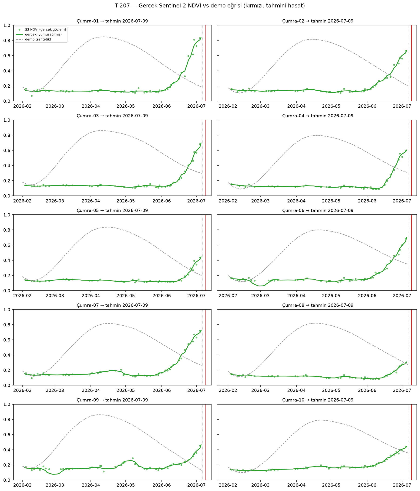

# T-207 — 10 Parsel Manuel Doğrulama Tablosu (Gerçek Sentinel-2)

> **Üretim:** `python -m ml.validate_t207` · veri: GEE `COPERNICUS/S2_SR_HARMONIZED`
> (SCL bulut maskesi) + `S1_GRD` VH · sezon 2026 · tahmin tarihi **2026-07-06**.
> **Kapsam:** Faz 2 kapı kriteri G2 — "10 parsel manuel doğrulama tablosu var".

## ⚠️ Kalibre edilmemiş — doğruluk iddiası yok (ADR-B-015)

Saha hasat etiketi henüz YOK. Bu tablo **MAE / ±gün isabet iddiası taşımaz**.
Doğruladığı şeyler:

1. Gerçek uydu verisiyle uçtan uca akış (GEE → fenoloji → kural → tahmin) hatasız çalışıyor.
2. Tahminler bölgesel hasat penceresi (DOY 167–213 + tolerans) içinde kalıyor.

Sentetik `harvest_labels.csv` GERÇEK veriye kıyas ölçütü değildir; 'demo tahmini' sütunu
yalnız iki veri kaynağının aynı motordan geçtiğini gösterir.

## 🔴 Ana bulgu: ürün deseni uyuşmazlığı

Gerçek NDVI eğrisi kışlık buğday fenolojisine 0/10 parselde uyuyor.

Uymayan parsellerde NDVI, buğday hasat penceresi içinde hâlâ **yükseliyor** —
kışlık buğdayda bu dönemde eğri düşer. Yorum: Bu OSM `farmland` parselleri bu
sezon büyük olasılıkla **yazlık ürün** (Çumra sulu tarımında yaygın: mısır, şeker
pancarı, ayçiçeği) ekilmiş; `crop_code=WHEAT_WINTER` varsayımı bu parseller için
bu sezon GEÇERLİ DEĞİL. Bu tam da T-207'nin yakalaması gereken türden bir bulgudur
ve kural motorunun neden **ekin doğrulaması** (ÇKS kaydı / üretici beyanı) olmadan
kullanılamayacağını gösterir (07_RISKLER R-02 veri riski).

**Aksiyon:** Faz 2 kapanışında pilot parsel listesi, ekimi ÇKS/üretici beyanıyla
doğrulanmış GERÇEK buğday parselleriyle değiştirilmeli (T-002/T-003 veri talebi).
Akış ve motor hazır; yalnız doğru parseller + saha etiketi gerekiyor.

## Özet tablo

| Parsel | Alan (ha) | Gözlem (bulutsuz) | Bulut % | POS (DOY) | Evre | Tahmini hasat (GERÇEK S2) | Kalan gün | Veri güveni | Pencere içi? | Demo tahmini (kıyas) |
|---|---|---|---|---|---|---|---|---|---|---|
| Çumra-01 | 4.5 | 47 | 50 | 186 | tepe dönem | **2026-07-09** | 3 (0–14) | %76 | ✅ | 2026-07-07 |
| Çumra-02 | 3.8 | 47 | 50 | 186 | tepe dönem | **2026-07-09** | 3 (0–14) | %76 | ✅ | 2026-07-07 |
| Çumra-03 | 8.8 | 46 | 51 | 186 | tepe dönem | **2026-07-09** | 3 (0–14) | %76 | ✅ | 2026-07-12 |
| Çumra-04 | 2.8 | 45 | 52 | 186 | tepe dönem | **2026-07-09** | 3 (0–14) | %76 | ✅ | 2026-07-13 |
| Çumra-05 | 2.3 | 45 | 52 | 186 | vejetatif | **2026-07-09** | 3 (0–14) | %76 | ✅ | 2026-07-07 |
| Çumra-06 | 4.8 | 47 | 50 | 186 | tepe dönem | **2026-07-09** | 3 (0–14) | %76 | ✅ | 2026-07-17 |
| Çumra-07 | 4.4 | 46 | 51 | 186 | tepe dönem | **2026-07-09** | 3 (0–14) | %76 | ✅ | 2026-07-08 |
| Çumra-08 | 8.1 | 47 | 50 | 186 | vejetatif | **2026-07-09** | 3 (0–14) | %76 | ✅ | 2026-07-09 |
| Çumra-09 | 5.0 | 49 | 48 | 186 | vejetatif | **2026-07-09** | 3 (0–14) | %76 | ✅ | 2026-07-07 |
| Çumra-10 | 4.6 | 47 | 50 | 186 | vejetatif | **2026-07-09** | 3 (0–14) | %76 | ✅ | 2026-07-19 |

**Pencere tutarlılığı:** 10/10 parsel bölgesel hasat penceresi içinde.

## Manuel kontrol notları (parsel başına)

Grafikler: `gorseller/t207_ndvi_karsilastirma.png` — yeşil noktalar gerçek S2 NDVI
gözlemi, yeşil çizgi yumuşatılmış eğri, gri kesik çizgi demo (sentetik) eğri,
kırmızı dikey çizgi gerçek-veri tahmini hasat tarihi.

| Parsel | Gerçek eğri gözlemi | Değerlendirme |
|---|---|---|
| Çumra-01 | POS DOY 186, max NDVI 0.83, son NDVI 0.83, 14g eğim +0.0302 | ❌ NDVI hasat penceresinde hâlâ YÜKSELİYOR — kışlık buğday deseni değil; yazlık ürün (mısır/pancar/ayçiçeği) olasılığı yüksek. Tahmin yalnız takvim önseli |
| Çumra-02 | POS DOY 186, max NDVI 0.67, son NDVI 0.67, 14g eğim +0.0219 | ❌ NDVI hasat penceresinde hâlâ YÜKSELİYOR — kışlık buğday deseni değil; yazlık ürün (mısır/pancar/ayçiçeği) olasılığı yüksek. Tahmin yalnız takvim önseli |
| Çumra-03 | POS DOY 186, max NDVI 0.70, son NDVI 0.70, 14g eğim +0.0278 | ❌ NDVI hasat penceresinde hâlâ YÜKSELİYOR — kışlık buğday deseni değil; yazlık ürün (mısır/pancar/ayçiçeği) olasılığı yüksek. Tahmin yalnız takvim önseli |
| Çumra-04 | POS DOY 186, max NDVI 0.60, son NDVI 0.60, 14g eğim +0.0241 | ❌ NDVI hasat penceresinde hâlâ YÜKSELİYOR — kışlık buğday deseni değil; yazlık ürün (mısır/pancar/ayçiçeği) olasılığı yüksek. Tahmin yalnız takvim önseli |
| Çumra-05 | POS DOY 186, max NDVI 0.44, son NDVI 0.44, 14g eğim +0.0195 | ❌ NDVI hasat penceresinde hâlâ YÜKSELİYOR — kışlık buğday deseni değil; yazlık ürün (mısır/pancar/ayçiçeği) olasılığı yüksek. Tahmin yalnız takvim önseli |
| Çumra-06 | POS DOY 186, max NDVI 0.70, son NDVI 0.70, 14g eğim +0.0231 | ❌ NDVI hasat penceresinde hâlâ YÜKSELİYOR — kışlık buğday deseni değil; yazlık ürün (mısır/pancar/ayçiçeği) olasılığı yüksek. Tahmin yalnız takvim önseli |
| Çumra-07 | POS DOY 186, max NDVI 0.72, son NDVI 0.72, 14g eğim +0.0189 | ❌ NDVI hasat penceresinde hâlâ YÜKSELİYOR — kışlık buğday deseni değil; yazlık ürün (mısır/pancar/ayçiçeği) olasılığı yüksek. Tahmin yalnız takvim önseli |
| Çumra-08 | POS DOY 186, max NDVI 0.31, son NDVI 0.31, 14g eğim +0.0114 | ❌ NDVI hasat penceresinde hâlâ YÜKSELİYOR — kışlık buğday deseni değil; yazlık ürün (mısır/pancar/ayçiçeği) olasılığı yüksek. Tahmin yalnız takvim önseli |
| Çumra-09 | POS DOY 186, max NDVI 0.46, son NDVI 0.46, 14g eğim +0.0170 | ❌ NDVI hasat penceresinde hâlâ YÜKSELİYOR — kışlık buğday deseni değil; yazlık ürün (mısır/pancar/ayçiçeği) olasılığı yüksek. Tahmin yalnız takvim önseli |
| Çumra-10 | POS DOY 186, max NDVI 0.44, son NDVI 0.44, 14g eğim +0.0093 | ❌ NDVI hasat penceresinde hâlâ YÜKSELİYOR — kışlık buğday deseni değil; yazlık ürün (mısır/pancar/ayçiçeği) olasılığı yüksek. Tahmin yalnız takvim önseli |

## Sonraki adım

- Gerçek saha hasat tarihleri (üretici/kooperatif/biçerdöver kaydı) `data/harvest_labels.csv`'ye
  `source=field` olarak girildiğinde aynı backtest kodu GERÇEK MAE üretir (≥30 etiket → Faz 4).

---
*Üretim tarihi: 2026-07-06 · kod: `hasat-zamani/ml/validate_t207.py`*